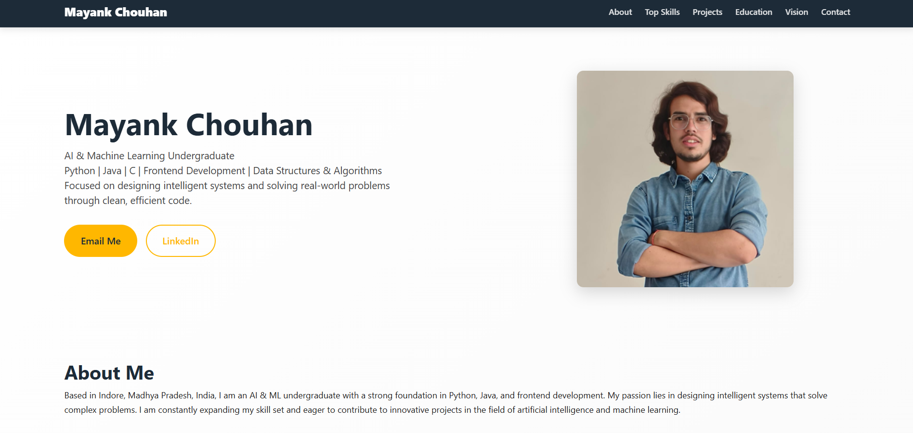

🌐 Mayank Chouhan – Portfolio Website
This is my personal portfolio website, designed to showcase my skills, projects, education, certifications, and vision as an AI & Machine Learning undergraduate and software developer.
The portfolio is built with a clean, modern UI and smooth interactions, focusing on clarity, responsiveness, and professional presentation.
🔗 Live Website

👨‍💻 About Me
I am Mayank Chouhan, an AI & Machine Learning undergraduate based in Indore, Madhya Pradesh, India.
I work with Python, Java, C, Frontend Development, and Data Structures & Algorithms, and I enjoy building intelligent systems and real-world solutions using clean, efficient code.

✨ Features

Responsive modern design (mobile-first)
Smooth scrolling navigation
Interactive hover-based project & education cards
Dedicated sections for:
About
Skills
Projects
Certifications
Education
Vision
Contact
Resume, GitHub, LinkedIn, and LeetCode links
Clean UI with professional typography
Deployed on GitHub Pages

🛠️ Tech Stack
HTML5 – Structure
CSS3 – Styling & layout
JavaScript (Vanilla) – Interactivity
Git & GitHub – Version control
GitHub Pages – Deployment

📂 Project Structure
Portfolio_Website/
│
├── index.html
├── style.css
├── script.js
├── image/
│ ├── photo.jpg
│ └── bg.jpg
├── certificates/
│ ├── Network_Technician.pdf
│ ├── Introduction_to_Modern_AI_certificate.pdf
│ └── Apply_AI.pdf
└── README.md

📁 Sections Included
Home – Introduction & quick links
About Me – Personal summary
Top Skills – Core technical strengths
Technical Footprint – GitHub, Resume, LeetCode
Projects – Portfolio & SOS Game
Certifications – Verified professional certificates
Education – Academic background
Vision – Long-term goals and mindset
Contact – Email & LinkedIn

🚀 How to Run Locally
Clone the repository
git clone https://github.com/mayankchouhan263/Portfolio_Website.git

Open the folder
cd Portfolio_Website

Open index.html in your browser
(or use Live Server in VS Code)

📸 Preview

🎯 Purpose
This portfolio is created to:
Showcase my technical skills and projects
Build a professional online presence
Apply for internships, jobs, and research roles
Practice frontend and software engineering skills

📬 Contact
Name: Mayank Chouhan
Email: mayankchouhan263@gmail.com
LinkedIn: linkedin.com/in/mayank-chouhan-714340327
GitHub: github.com/mayankchouhan263

⭐ Support
If you like this project, please consider giving it a ⭐ on GitHub.
It motivates me to build more and better projects!

🔮 Future Improvements
Add dark/light mode
Add animations using GSAP / Framer Motion
Add backend contact form
Add blog section
Convert to React-based portfolio
add API to include Chatbot
